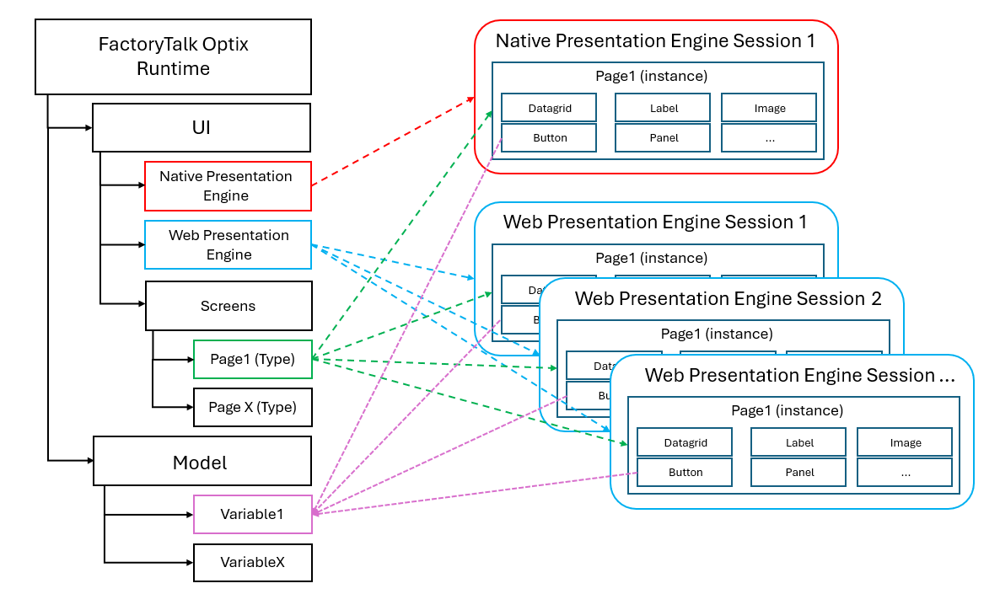

# Accessing project nodes

## Project context

Accessing the path of the node will return the project-level node, this is good for global elements (Model Variables, PLC Tags, etc) but it cannot be used to access session-based elements, as each user session will have a unique instance of windows and pages with uniques NodeIds

### Overview

FactoryTalk Optix graphical interface is based on the object's oriented paradigm, this means that when defining UI elements at design-time, these are actually created as object types. When the runtime starts, and a session is created (NativePresentationEngine creates automatically one UI instance, each client of the WebPresentationEngine creates one UI instance), this session is derived from the UI type that was designed, thus becoming an instance.

Each session lives as an independent object, each session can interact with global objects (such as Model variables or PLC tags) but cannot access other sessions, when calling methods that targets a session object (such as the refresh of a DataGrid), it can only affect the session where the method was called, other instances and sessions are unaffected.

NetLogic are also affected by this functionality:
- When using the `Project.Current.Get` syntax, only the project definition can be accessed, if a UI element is manipulated using such syntax, the session instance must be destroyed and recreated in order to inherit the new changes (for example navigating to a different page and then coming back)
- When placing the NetLogic inside a page (Screen) and using the `Owner.Get` syntax, the specific instance where the NetLogic is executed gets manipulated and the UI is immediately refreshed. Only the instance where the NetLogic exists can be accessed, a session-based NetLogic cannot interact with other sessions, only with elements in the current session or global objects (such as PLC tags or Model variables).

### Summary

- Each session of a PresentationEngine creates an instance of the UI types
- Each session is completely independent from other session
- A session can only interact with:
    - Elements in the same session
    - Global objects (Model variables, PLC tags, alarms, etc)
- A session cannot interact with other sessions
- Session changes are discarded when the instance is destroyed (page is changed or reloaded)
    - Retentivity cannot be applied to session objects
    - Retentivity should never be applied to any UI object
- A session can access global objects, but global objects cannot access session objects, for example:
    - A global NetLogic cannot refresh the DataGrid of a session, a global NetLogic can only access nodes at the project level (such as alarms, PLC tags, Model variables, etc)
    - A session NetLogic can access all global objects, all elements of the current UI session but cannot access other sessions.

### Examples

#### Refreshing a DataGrid

As the DataGrid is a session object, the NetLogic to refresh a DataGrid must be placed at a session level

#### Creating a new alarm

As the Alarm is a global object, the NetLogic can be either at the session level or at a global level

#### Performing an SQL query

Here it depends on the final goal:

- If just inserting data to a database, the NetLogic can be either at the session level or at a global level, the data can be passed as global variable or as argument of the called method
- If performing a query (such as a SELECT) depending on some parameters from the user, the NetLogic must be placed at the session level (where TextBox or other controls can be accessed)
- If performing a query (such as a SELECT or an INSERT) depending on some values from the controller (PLC), the NetLogic can be placed either at a global or session level

## Navigating to a node

### The `Node.Get` syntax

The `Get` method is used to fetch nodes from the current project, it can retrieve both session and global objects (nodes), this method also accepts a type that will be passed to the variable type
- Example:
    - `var myButton = … .Get<Button>("path/to/button");` -> Will create a _myButton_ variable of Type `FTOptix.UI.Button` pointing to the desired element
- After the object has been casted to the proper path, you can access its properties using IntelliSense
    - Example:
        - `myButton.Text = Hello;`

### Accessing global objects

In order to manipulate any project element, you first need to access it, this can be either done by getting its NodeId or its node object

- Examples:
    - `var myNodeId = Project.Current.Get( [path/to/node] ).NodeId;`
    - `var myObject = Project.Current.Get( [path/to/node] );`

    - Where `path/to/node` can be obtained by right clicking any element of the IDE and then clicking `Copy path to node`, here you need to remember to remove the project name from the pasted element
        - Example:
            - `NewHMIProject25/Model/MyCustomMotor` --> `Model/MyCustomMotor`

### Accessing session-based objects

Now that we know how session works, it's easy to understand the benefits of placing a NetLogic in a session-based object (such as the page you want to access or manipulate) and then use the relative addressing to retrieve the right element
    - Example:
        - `var ButtonText = Owner.Get("MotorButton/Text");`

### The `Node.Find` syntax

You can also search for a specific object by knowing its `BrowseName` by using the `Find` method, this can be useful but it is not recommended as it is very slow to perform (it will recursively browse the whole project until it gets to the first element with such node)
- Example:
    - `var myObj = Project.Current.Find("ObjectName");`

## Casting vs Type passing

### Passing the object type

Type parameter can be used with "generic methods" that allows using different types. A generic method can be called either without an argument (anything that applies to any node such as `BrowseName` or `NodeId`) or by specifying the type of argument within angle brackets
- Example:
    - `var myfolder = Project.Current.Get<Folder>("Model\MyFolder");`

Using this type passing option, the returned node is `null` if:
- Node does not exist
- The node does not match the specified type (e.g: `MyFolder` is an `Object` and not a `Folder`)

### Casting from IUANode

A cast is an explicit conversion, to perform a cast, specify the type that you are casting to in parentheses in front of the value or variable to be converted.
    - Example:
        - `var myfolder = (Folder)Project.Current.Get("Model\MyFolder");`

Using this casting option, the node is returned as null only if completely missing, if the object type cannot be casted, an exception is thrown.

### Summary

Result is very similar, as best practice we suggest to use the type passing approach unless casting is a specific requirement to achieve the result
