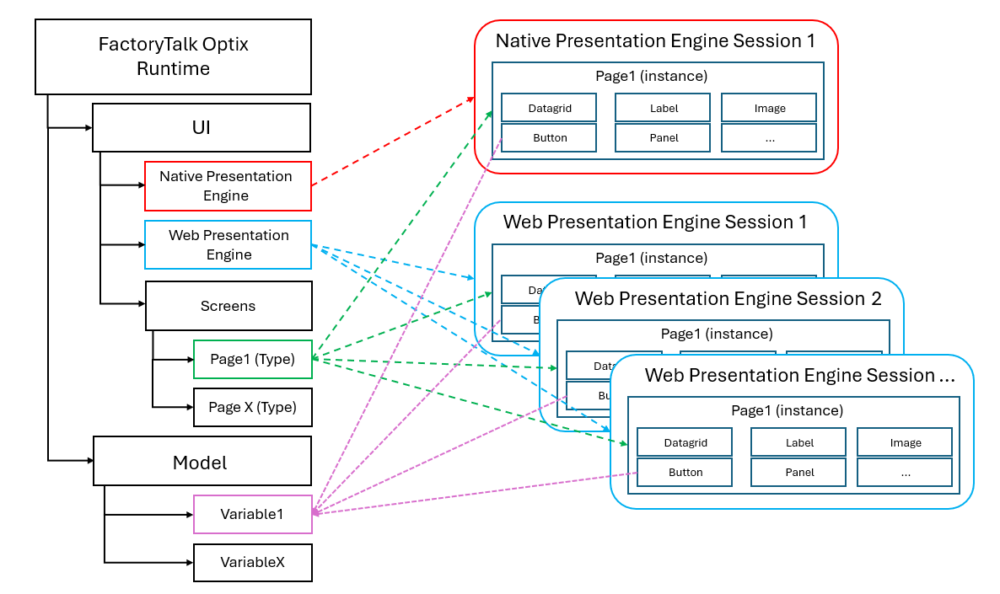

# The Information Model

## Overview

In FactoryTalk Optix, each and every object is a `node`, the definition of a node comes from the OPC/UA specifications which states that an OPC/UA node is like an entity representing information. Some Nodes are Variables, DataType, References, Object, Methods... depending of what they are used for.

The OPC/UA specifications can be found at the following link [opcfoundation resources](https://opcfoundation.org/developer-tools/documents/?type=Specification) and search for [OPC 10000-1 UA Part 1: Overview and Concepts](https://opcfoundation.org/developer-tools/documents/view/158) and [OPC 10000-3 UA Part 3: Address Space Model](https://opcfoundation.org/developer-tools/documents/view/160)

Understanding the concept of nodes is crucial when working with FactoryTalk Optix because it forms the backbone of the OPC/UA information model, which FactoryTalk Optix leverages for data representation and interaction. Nodes represent various types of information and their relationships, enabling a standardized way to access and manipulate data within the system. This allows integration and interoperability between different components and devices, ensuring that data can be efficiently managed and utilized across the entire project.

### The Information Model of OPC/UA

The OPC Unified Architecture (OPC/UA) defines a rich information model that allows for complex data representation and interaction. At the core of this model is the concept of a "node". A node is an entity that represents information and can be of various types, each serving a different purpose within the information model. The major properties of a node include:

- **NodeId**: A unique identifier for the node within the address space.
- **BrowseName**: A human-readable name used for browsing the node.
- **DisplayName**: A localized name intended for display purposes.
- **Description**: A localized text description of the node.

Nodes can be of different types, including:

- **Object**: Represents physical or abstract entities.
- **Variable**: Holds a value and can have a data type.
- **Method**: Represents callable functions or procedures.
- **ObjectType**: Defines the type of an object.
- **VariableType**: Defines the type of a variable.
- **ReferenceType**: Defines the type of a reference between nodes.
- **DataType**: Defines the data type of a variable.
- **View**: Represents a subset of the address space for browsing.

These nodes and their properties form the foundation of the OPC/UA information model, enabling a standardized way to represent and interact with data across different systems and devices.

### The Information Model of FactoryTalk Optix

As everything in FactoryTalk Optix is actually an OPC/UA node, we can implement some complex scenarios like:

- Allowing other applications (both FactoryTalk Optix or third-parties) to read and write project nodes
    - This includes exposing project elements like Databases, PLC Tags, Model variables, UI objects, etc
- Allowing other applications to produce and consume alarms and events using the OPC/UA A&E protocol
- Manipulating parts of the project using NetLogic or an external OPC/UA client

## Project context

Accessing the path of the node will return the project-level node, this is good for global elements (Model Variables, PLC Tags, etc) but it cannot be used to access session-based elements, as each user session will have a unique instance of windows and pages with uniques NodeIds

### Overview

FactoryTalk Optix graphical interface is based on the object's oriented paradigm, this means that when defining UI elements at design-time, these are actually created as object types. When the runtime starts, and a session is created (NativePresentationEngine creates automatically one UI instance, each client of the WebPresentationEngine creates one UI instance), this session is derived from the UI type that was designed, thus becoming an instance.

Each session lives as an independent object, each session can interact with global objects (such as Model variables or PLC tags) but cannot access other sessions, when calling methods that targets a session object (such as the refresh of a DataGrid), it can only affect the session where the method was called, other instances and sessions are unaffected.

NetLogic are also affected by this functionality:
- When using the `Project.Current.Get` syntax, only the project definition can be accessed, if a UI element is manipulated using such syntax, the session instance must be destroyed and recreated in order to inherit the new changes (for example navigating to a different page and then coming back)
- When placing the NetLogic inside a page (which can be something like a Screen, a Panel, a Rectangle, or any UI object) and using the `Owner.Get` syntax, the specific instance where the NetLogic is created gets accessed and the UI is immediately refreshed. Only the instance where the NetLogic exists can be accessed, a session-based NetLogic cannot interact with other sessions, only with elements in the current session or global objects (such as PLC tags or Model variables).

### Summary

- Each session of a PresentationEngine creates an instance of the UI types
- Each session is completely independent from other session
- A session can only interact with:
    - Elements in the same session
    - Global objects (Model variables, PLC tags, alarms, etc)
- A session cannot interact with other sessions
- Session changes are discarded when the instance is destroyed (page is changed or reloaded)
    - Retentivity cannot be applied to session objects
    - Retentivity should never be applied to any UI object
- A session can access global objects, but global objects cannot access session objects, for example:
    - A global NetLogic cannot refresh the DataGrid of a session, a global NetLogic can only access nodes at the project level (such as alarms, PLC tags, Model variables, etc)
    - A session NetLogic can access all global objects, all elements of the current UI session but cannot access other sessions.

### Examples

#### Refreshing a DataGrid

As the DataGrid is a session object, the NetLogic to refresh a DataGrid must be placed at a session level

#### Creating a new alarm

As the Alarm is a global object, the NetLogic can be either at the session level or at a global level

#### Performing an SQL query

Here it depends on the final goal:

- If just inserting data to a database, the NetLogic can be either at the session level or at a global level, the data can be passed as global variable or as argument of the called method
- If performing a query (such as a SELECT) depending on some parameters from the user, the NetLogic must be placed at the session level (where TextBox or other controls can be accessed)
- If performing a query (such as a SELECT or an INSERT) depending on some values from the controller (PLC), the NetLogic can be placed either at a global or session level